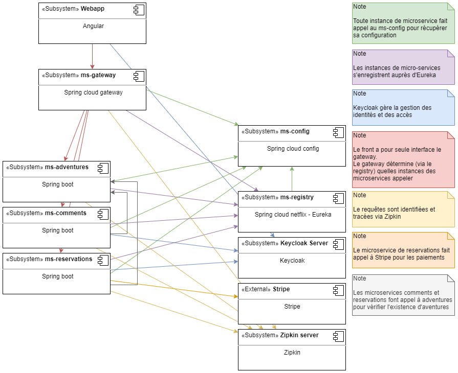
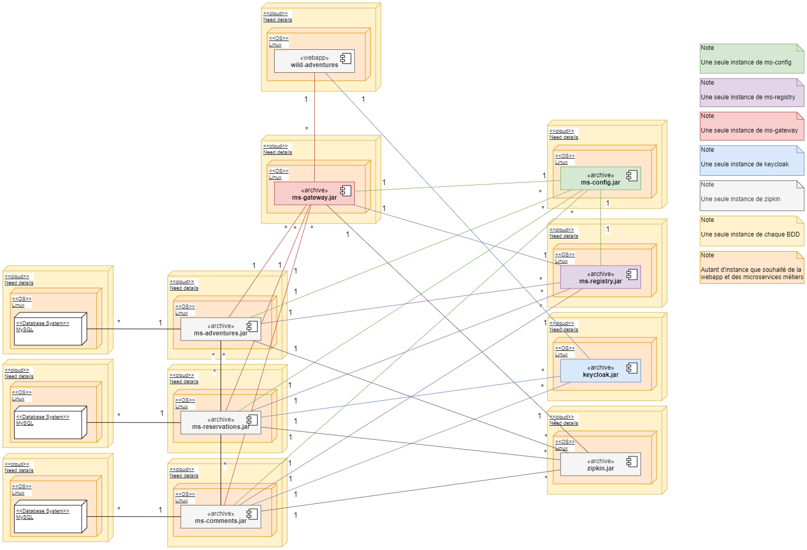

# wild adventures
*Ce projet est à but pédagogique*.

Sommaire  
- [Contexte](#contexte)
  - [Enoncé](#enoncé)
  - [Technique](#technique)
- [Solution](#solution)
  - [Lancer le projet](#lancer-le-projet)
  - [Documentation](#documentation)
    - [Composants](#composants)
    - [Déploiement](#déploiement)
    - [Compilation](#compilation)
  - [Autres documentations](#autres-documentations)

## Contexte

### Enoncé
L’agence « Wild Adventures » organise des voyages d’aventure autour du globe pour les passionnés de sensations fortes : traversées de déserts, séjours dans les pôles, croisières sauvages, etc.

Fort de son succès, l'agence a décidé d'ouvrir son catalogue au monde entier via une application web.

Cette application devra :

- Afficher les catégories d’aventures afin de permettre au client de choisir.
- Lister toutes les aventures disponibles dans une catégorie : image, prix et dates.
- Afficher chaque aventure dans une page avec : images, prix, date, descriptif, nombre de participants.
- Mettre en oeuvre un système de commentaires de client pour chaque aventure, à afficher sur la page de celle-ci.
- Permettre au client de s'inscrire et d'accéder à son espace contenant la liste de ses commandes.
- Fournir la fonctionnalité de paiement de l’aventure à réserver.

### Technique
Pour réaliser ce projet en groupe, vous mettrez nécessairement en oeuvre une  architecture Microservices. L’architecture Backend devra ainsi être totalement découplée du FrontEnd, permettant ainsi d’intégrer aisément d’autres clients.  
Vous développerez toute l’application avec la dernière version stable de tous les composants que vous allez choisir d’employer.  
Le code doit être dès le départ stocké sur un Git.  
Vous utiliserez Maven pour gérer les dépendances et le packaging au sein de chaque microservice. Une tâche Maven doit pouvoir builder, packager et lancer le microservice dans un Tomcat automatiquement.

## Solution

### Lancer le projet
*Pré-requis*
- docker-compose installé ([installation docker-compose](https://docs.docker.com/compose/install/))
- un peu moins de 10Go disponibles (pour la génération des images docker)
- environ 20min (build + lancement des services (2min))

*Lancement*
1) Placez-vous dans le dossier docker  
`$ cd docker`
2) Lancez les services  
`$ docker-compose up -d`  
OU vous pouvez aussi lancer plusieurs instances des microservices métiers:  
`$ docker-compose up -d --scale adventures=2 --scale comments=1 --scale reservations=3`
3) Vous pouvez consulter votre navigateur aux adresses suivantes:
  - `localhost:8080` : le point d'entré du back-end
  - `localhost:8081` : serveur keycloak (configuré actuellement avec les credentials suivants username: `admin`, password: `admin`)
  - `localhost:4200` : l'application utilisateur
  - `localhost:9411` : serveur zipkin

### Documentation

#### Composants

Notre système est composé de la manière suivante :
- 4 microservices edges
  - ms-config fourni les configurations des différents autres microservices
  - ms-registry permet à tous les microservices de s'enregistrer, il liste les instances de chaque microservice
  - ms-gateway permet de fournir un seul point d'entrée ; il se basera sur le registre afin de répartir la charge
  - zipkin permettra de tracer les requêtes http
- 3 microservices métiers
  - ms-adventures joue le rôle de catalogue et permet d'accéder aux aventures
  - ms-comments permet d'accéder, d'ajouter et de retirer des commentaires sur les aventures
  - ms-reservations permet de passer 
- 1 serveur keycloak qui permet de gérer l'identité et l'accès des utilisateurs
- 1 front-end  
On utilise, en outre, un système externe de paiment : Stripe  

---

#### Déploiement

Afin de déployer correctement cette solution, il faut s'assurer des points suivants:
- Architecture microservice:
  - Il ne doit y avoir qu'une instance des microservices suivants :
    - ms-config
    - ms-registry
    - ms-gateway
    - zipkin
    - keycloak
  - De même il ne faut qu'une instance pour chacune des bases de données (1 BDD adventures, 1 BDD comments, 1 BDD reservations)
  - Il peut cependant y avoir plusieurs instance des microservices métiers (adventures, comments, reservations)
- Ordre de lancement :  
  1) keycloak | zipkin | adventuresmysql | commentsmysql | reservationsmysql
  2) ms-config
  3) ms-registry
  4) ms-gateway | ms-adventures | ms-comments | ms-reservations | front-end
- Variables d'environnement:
  - ms-config:
    - `GIT_CONFIG_URI`: l'url du repository git où se trouvent les fichiers de configurations ([actuellement ici](https://github.com/Khyonn/wild-adventures-configs))
    - `GIT_CONFIG_BRANCH` : la branche du repository contentant les fichiers de configurations
  - ms-registry | ms-gateway :
    - `EDGE_CONFIG_HOST` : l'hôte microservice ms-config
  - ms-adventures | ms-comments | ms-reservations :
    - `CONFIG_HOST` : l'hôte du microservice ms-config
- Quelque soit le serveur depuis lequel le front-end est déployé, il faudra faire proxy pour toutes requêtes lancées vers `api/` et les rediriger vers l'adresse du ms-gateway

---

#### Compilation

*Pré-requis : nécessite une version du jdk supérieure à 14, maven et une version de node supérieure à v12.16.3*

Les différents micro-services (ms-config, ms-registry, ms-gateway, ms-adventres, ms-comments, ms-reservations) peuvent être compilé via la ligne de commande suivante :  
`mvn install`

Concernant le front, il faudra éditer en amont le fichier `environments/environment.prod.ts` afin d'y renseigner l'url de keycloak, puis lancer la compilation:
`npm install && npm run build`

### Autres documentations
- Microservices edges
  - [ms-config](/application/ms-edge/ms-config/README.md)
  - [ms-registry](/application/ms-edge/ms-registry/README.md)
  - [ms-gateway](/application/ms-edge/ms-gateway/README.md)
- Microservices business
  - [ms-adventures](/application/ms-business/ms-adventures/README.md)
  - [ms-comments](/application/ms-business/ms-comments/README.md)
  - [ms-reservations](/application/ms-business/ms-reservations/README.md)
- [Front-end](/application/front-end/wild-adventures/README.md)

